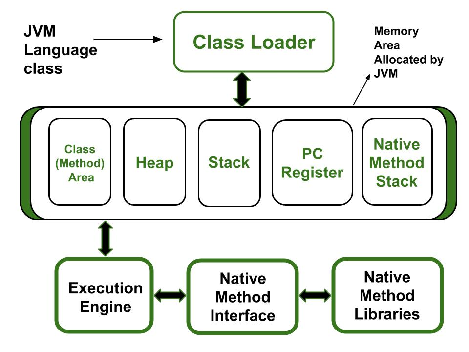
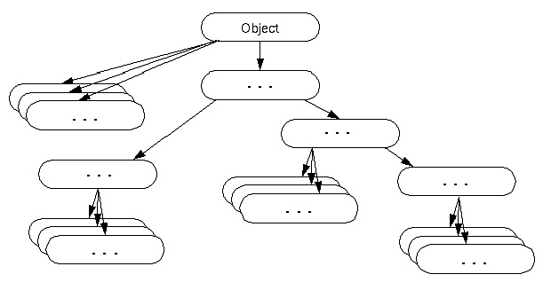
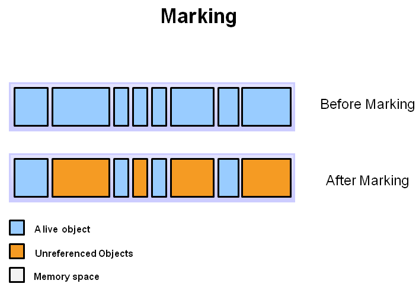
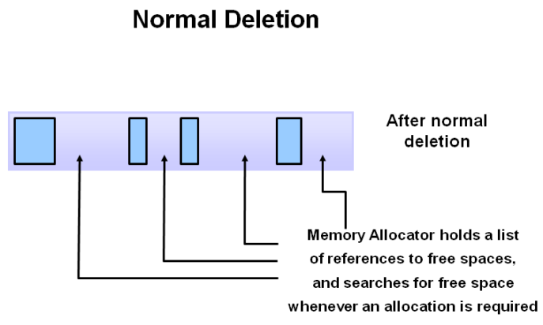
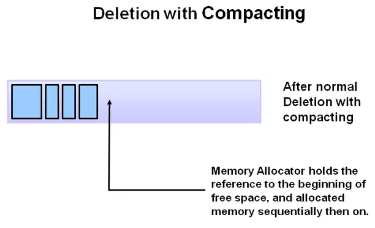

**CÁCH JAVA LƯU TRỮ DỮ LIỆU**
- [I. Cách Java lưu trữ dữ liệu:](#i-cách-java-lưu-trữ-dữ-liệu)
  - [Kiến trúc bộ nhớ trong Java:](#kiến-trúc-bộ-nhớ-trong-java)
  - [1. Kiểu dữ liệu nguyên thủy:](#1-kiểu-dữ-liệu-nguyên-thủy)
  - [2. Kiểu dữ liệu đối tượng:](#2-kiểu-dữ-liệu-đối-tượng)
  - [3. Class Object:](#3-class-object)
  - [4. Wrapper Class:](#4-wrapper-class)
- [II. Các phương thức khởi tạo trong Java:](#ii-các-phương-thức-khởi-tạo-trong-java)
  - [1. Hàm khởi tạo không có tham số (no argument constructor):](#1-hàm-khởi-tạo-không-có-tham-số-no-argument-constructor)
  - [2. Hàm khởi tạo có tham số (parameterized constructor)](#2-hàm-khởi-tạo-có-tham-số-parameterized-constructor)
  - [3. Hàm khởi tạo mặc định (default constructor):](#3-hàm-khởi-tạo-mặc-định-default-constructor)
  - [4. Từ khóa "super":](#4-từ-khóa-super)
  - [5. Từ khóa "this":](#5-từ-khóa-this)
- [III. Garbage Collector trong Java:](#iii-garbage-collector-trong-java)
- [IV. Pass by Value:](#iv-pass-by-value)


# I. Cách Java lưu trữ dữ liệu:
## Kiến trúc bộ nhớ trong Java:
Khi chạy chương trình Java, JVM sẽ yêu cầu hệ điều hành (Windows, Linux, Mac,..) cấp phát một không gian bộ nhớ trong RAM. JVM sẽ phân chia không gian bộ nhớ này được cấp phát thành các vùng nhớ khác nhau để lưu những dữ liệu cần thiết cho việc chạy chương trình.

- **Vùng nhớ Class (method) Area:**
  -  Giúp lưu trữ dữ liệu cho mỗi lớp (class). Đó có thể là tên lớp, lớp đó có access modifier gì, các thuộc tính và phương thức của lớp, các đoạn code của phương thức,…
  -  Lưu ý, vùng nhớ này lưu thông tin về lớp (class), chứ không phải đối tượng (object) của lớp (class).
- **Vùng nhớ Heap:**
  - Là vùng nhớ được sử dụng trong khi đang chạy chương trình (runtime). Vùng nhớ heap giúp lưu trữ tất các đối tượng (object) và mảng (array) được tạo ra với từ khóa "new" trong Java. Dung lượng sử dụng của heap sẽ tăng giảm phụ thuộc vào các object được tạo ra.
  - Thời gian tồn tại của object phụ thuộc vào Garbage Collector (GC) của Java. Khi một object bị null hoặc không còn được sử dụng thì GC sẽ xóa object khỏi bộ nhớ.
  - Dung lượng vùng heap thường lớn hơn vùng nhớ stack.
- **Vùng nhớ Stack:**
  - Bộ nhớ để lưu các biến cục bộ (local variable), các lời gọi hàm, các đối số được truyền vào hàm hay các biến tham chiếu.
  - Khi hàm được gọi thì một vùng nhớ được tạo ra trong stack. Vùng nhớ này lưu lời gọi hàm, các biến trong hàm đó. Khi hàm thực hiện xong, vùng nhớ cho hàm trong stack sẽ được giải phóng.
  - Bộ nhớ stack thường có dung lượng nhỏ.
- **Vùng nhớ Programe Counter Register:** Là vùng nhớ được tạo ra khi khởi tạo một Thread và dành riêng cho Thread đó.
- **Vùng nhớ Native Method Stack:** Còn được gọi là C stack, native method stack không lưu chương trình Java mà lưu các hàm của ngôn ngữ C gọi các hàm của Java. Bộ nhớ này được cấp phát cho mỗi Thread khi nó được tạo.
## 1. Kiểu dữ liệu nguyên thủy:
- Với Java là ngôn ngữ lập trình hướng đối tượng, hầu hết mọi thứ đều là hướng đối tượng tạo ra từ lớp, cấu trúc ... Tuy nhiên có các dữ liệu gọi là **kiểu dữ liệu nguyên thủy không phải là đối tượng lớp**. Biến kiểu dữ liệu này chỉ lưu một giá trị đơn giản và không cho phép định nghĩa toán tử mới. Java có 8 kiểu dữ liệu nguyên thủy:
  - byte
  - short
  - int 
  - long 
  - char
  - float
  - double
  - boolean
- Các kiểu dữ liệu này được lưu trữ trong **bộ nhớ Stack**
- Là kiểu dữ liệu có tính chất tham trị
```java
int a = 4;
int b = a;
b = b + 1;
System.out.println(a); // in ra 4
System.out.println(b); // in ra 5
```
## 2. Kiểu dữ liệu đối tượng:
- Kiểu dữ liệu đối tượng được chia làm 2 loại:
    - **Framework định nghĩa**: Những đối tượng này được tạo sẵn và công việc của chúng ta chỉ việc gọi lên và sử dụng chúng, ví dụ: File, String, Scanner, ...
    - **Do người dùng định nghĩa**: Chính là những class được chúng ta define từ những đối tượng trong bài toán OOP, ví dụ: HocSinh, SinhVien, …
- Khi khởi tạo, đối tượng được cấp phát một vùng nhớ riêng để lưu trữ các dữ liệu của đối tượng đó. Vùng nhớ lưu trữ các đối tượng là **bộ nhớ heap**.
- Là kiểu dữ liệu có **tính chất tham chiếu**
```java
public class SinhVien {
    private String name;
    public SinhVien(String name){
        this.name = name;
    }
    public String getName() {
        return name;
    }
    public void setName(String name) {
        this.name = name;
    }
    public static void main(String[] args) {
        SinhVien sv1 = new SinhVien("Trang");
        SinhVien sv2 = sv1;
        sv2.setName("Chang");
        System.out.println(sv1.getName()); // in ra Chang
        System.out.println(sv2.getName()); // in ra Chang
    }
}
```
## 3. Class Object:

- Theo mặc định, lớp Object là lớp cha của tất cả các lớp trong Java. Nói cách khác, nó là lớp cao nhất của Java.
- Lớp Object là khá lợi ích nếu bạn muốn tham chiếu bất cứ đối tượng nào có kiểu mà bạn không biết. Chú ý rằng biến tham chiếu của lớp cha có thể tham chiếu tới đối tượng lớp con, và được gọi là Upcasting.
- Lớp Object là một lớp mặc định của Java và là lớp đặc biệt. Tất cả các class khác trong Java phải kế thừa nó. 

  - Nhưng để cho gọn chúng ta hay ẩn đi, ví dụ không cần viết **class Student extends Object**, thực tế là vẫn mặc định extends
## 4. Wrapper Class:
- Cung cấp cách để sử dụng các kiểu dữ liệu nguyên thủy như int, boolean, v.v., dưới dạng đối tượng. 
- Khi chúng ta tạo một đối tượng của một lớp Wrapper, nó chứa một trường và trong trường này, chúng ta có thể lưu trữ các kiểu dữ liệu nguyên thủy. Mỗi kiểu dữ liệu nguyên thủy trong Java đều có một lớp wrapper tương ứng.

|**Kiểu nguyên thủy**|**Kiểu Wrapper**|
|--------------------|----------------|
|boolean|Boolean      |
|char|Character   | 
|byte       |Byte   |
|short       |Short   |
|int       |Integer   |
|long       |Long   |
|float       |Float   |
|double       |Double   |

**Boxing và Unboxing**
- **Boxing:** là quá trình chuyển đổi một kiểu dữ liệu nguyên thủy thành một đối tượng của lớp wrapper tương ứng. 
- **Unboxing:** là quá trình chuyển đổi một đối tượng của lớp wrapper thành giá trị kiểu dữ liệu nguyên thủy tương ứng. 
- **Autoboxing:** là một chức năng được cài sẵn trong wrapper class, giúp chương trình tự động nhận dạng kiểu dữ liệu nguyên thủy khi gán vào đối tượng của wrapper class -> giúp chúng ta lược bỏ đi phần chỉ định phương thức khi viết chương trình
```java
Integer i = Integer.valueOf(8);
int val = i.intValue();
```
Đoạn code trên có thể rút gọn như sau: 
```java
Integer i = 8;
int val = i;
```

# II. Các phương thức khởi tạo trong Java:
**Hàm khởi tạo - Constructor** trong Java là một hàm có tên giống với tên lớp. Hàm này được gọi khi khởi tạo đối tượng. Hàm khởi tạo **không có kiểu trả về**
```java
public class SinhVien {
    public String name;
    public SinhVien(){
        System.out.println("Hello");
        name = "Trang";
    }
    public static void main(String[] args) {
        SinhVien sv1 = new SinhVien();
        System.out.println(sv1.name);
    }
}
```
Lớp SinhVien có 1 hàm khởi tạo là SinhVien(). Hàm này khởi tạo cho thuộc tính `name`

Khởi tạo đối tượng với hàm khởi tạo:
```java
SinhVien sv1 = new SinhVien();
```
Khi đó đối tượng sẽ được phát vùng nhớ trên bộ nhớ Heap để lưu trữ dự liệu đối tượng đó.

Trong Java hàm khởi tạo có thể chia làm 3 loại:
## 1. Hàm khởi tạo không có tham số (no argument constructor):
- Hàm khởi tạo của 1 lớp có thể không có tham số nào

Cú pháp: 
```java
class <tên Lớp>{
  accesmodifier <tên Lớp>(){
    // thân hàm
  }
}
```
Ví dụ: 
```java
public class SinhVien {
    public String name;
    public SinhVien(){
        name = "Trang";
    }
    public static void main(String[] args) {
        SinhVien sv1 = new SinhVien();
        System.out.println(sv1.name);
    }
}
```
## 2. Hàm khởi tạo có tham số (parameterized constructor)
- Hàm khởi tạo có thể có 1 hoặc nhiều tham số

Ví dụ: 
```java
public class SinhVien {
    public String name;
    public SinhVien(String name){
        this.name = name;
    }
    public static void main(String[] args) {
        SinhVien sv1 = new SinhVien("Trang");
        System.out.println(sv1.name);
    }
}
```
- Trong một lớp, có thể có nhiều hàm khởi tạo cùng tên nhưng khác tham số. Ta gọi đó là **nạp chồng hàm khởi tạo (constructor overloading)**.

Ví dụ:
```java
public class SinhVien {
    public String name, msv, birth;
    int age;
    public SinhVien(String name, String msv){
        this.name = name;
        this.msv = msv;
    }
    public SinhVien(int age){
        this.age = age;
    }
    public SinhVien(String birth){
        this.birth = birth;
    }
    public static void main(String[] args) {
        SinhVien sv1 = new SinhVien("Trang", "CN01");
        SinhVien sv2 = new SinhVien("11/11");
        SinhVien sv3 = new SinhVien(20);
        System.out.println(sv1.name);
    }
}
```
## 3. Hàm khởi tạo mặc định (default constructor):
- Nếu trong lớp không có hàm khởi tạo này, trình biên dịch Java sẽ tự động tạo ra một hàm khởi tạo không có tham số. Hàm khởi tạo này gọi là hàm khởi tạo mặc định (default constructor).
- Hàm khởi tạo mặc định này sẽ tự khởi tạo các thuộc tính của đối tượng với các giá trị mặc định.

Ví dụ: 
```java
class Main {
  int a;
  boolean b;
  public static void main(String[] args) {
    Main obj = new Main();
    System.out.println( obj.a); // in ra 0
    System.out.println(obj.b); // in ra false
  }
}
```
## 4. Từ khóa "super":
Từ khóa **"super"** trong Java được sử dụng trong lớp con (subclass) để truy cập các thành phần trong lớp cha (superclass):
- Giúp gọi phương thức của lớp cha được ghi đè (overriding) trong lớp con: 
  - Khi lớp con gọi phương thức được ghi đè (overriding) có cùng tên với phương thức của lớp cha thì phương thức được gọi đó là của lớp con.
  ```java
  class LopCha{
    protected void xuat(){
        System.out.println("Lop cha.");
    }
  }
  class LopCon extends LopCha{
    public void xuat(){
        System.out.println("Lop con.");
    }
  }
  public class Test{
      public static void main(String[] args) {
          LopCon abc = new LopCon();
          abc.xuat(); // in ra "Lop con."
      }
  }
  ```
  - Chúng ta có thể gọi phương thức của lớp cha trong lớp con sau khi đã ghi đè (overriding) phương thức đó bằng cách sử dụng **từ khóa super**.
  ```java
  class LopCha{
    public void xuat(){
        System.out.println("Lop cha.");
    }
  }
  class LopCon extends LopCha{
      public void xuat(){
          super.xuat();//gọi hàm xuat() của lớp cha
          System.out.println("Lop con.");
      }
  }
  public class Test{
      public static void main(String[] args) {
          LopCon abc = new LopCon();
          abc.xuat(); // in ra "Lop cha." và "Lop con."
      }
  }
  ```
- Giúp truy cập thuộc tính của lớp cha
- Giúp truy cập hàm khởi tạo của lớp cha

## 5. Từ khóa "this":
Từ khóa **this** trong Java là một biến tham chiếu được sử dụng để tham chiếu tới đối tượng của lớp hiện tại.
- Từ khóa this trong java có thể được dùng để **tham chiếu tới biến instance của lớp hiện tại**. Nếu có sự trùng tên nhau giữa biến toàn cục và tham số khiến bạn bị phân vân. Từ khóa this sẽ giúp bạn giải quyết sự phân vân của bạn.
- Sử dụng để **gọi Constructor của lớp hiện tại**. Cách sử dụng này sẽ hữu dụng hơn nếu bạn có nhiều Constructor trong một lớp và bạn muốn sử dụng lại Constructor.
  - Quy tắc: this() phải được khai báo dòng lệnh đầu tiên trong Constructor.
  ```java
  public class Student{
    int id;
    String name;
    Student() {
        System.out.println("call Constructor mặc định");
    }
    Student(int id, String name) {
        this(); // nó được sử dụng để gọi Constructor của lớp hiện tại
        this.id = id;
        this.name = name;
    }
    void display() {
        System.out.println(id + " " + name);
    }
    public static void main(String args[]) {
        Student e1 = new Student(1, "Trang");
         // in ra "call Constructor mặc định"
    }
  }
  ```
- **Gọi phương thức của lớp hiện tại:** Nếu bạn không sử dụng từ khóa this, trình biên dịch sẽ tự động thêm từ khóa this cho việc gọi phương thức.
  ```java
  public class Example{
    void m() {
        System.out.println("Gọi phương thức bằng từ khóa this");
    }
    void n() {
        this.m();
    }
    void p() {
        n(); // trình biên dịch sẽ thêm this để gọi phương thức n() như this.n()
      }
    }
  ```
- Sử dụng từ khóa this như một **tham số của phương thức**: trong việc xử lý sự kiện hoặc trong trường hơp mà chúng ta phải cung cấp tham chiếu của một lớp cho một lớp khác.
  ```java
  public class Example{
    void m(Example4 obj) {
        System.out.println("Hello Java");
    }
    void p() {
        m(this);
    }
  }
  ```
- Sử dụng từ khóa this như một **tham số của Constructor**: Tính năng này rất hữu ích nếu chúng ta phải sử dụng một đối tượng trong nhiều lớp.
- Để **trả về instance của lớp hiện tại**: trong trường hợp này, kiểu trả về của phương thức phải là kiểu class (không là kiểu nguyên thủy).

# III. Garbage Collector trong Java:
- **Garbage collection (Quá trình thu gom rác)** trong máy ảo Java (JVM) là quá trình xác định và loại bỏ các Object không được sử dụng (unreferenced) khỏi bộ nhớ Heap. 
- “Một đối tượng như thế nào là không được sử dụng nữa?”- Đó là **các đối tượng không được tham chiếu nữa**.
- Các trường hợp sau là đối tượng không được tham chiếu nữa:
  - Trường hợp 1: Đối tượng được gán là nul
    ```java
    Employee e1 = new Employee();
    e1 = null;
    ```
  - Trường hợp 2: Gán đối tượng đến một tham chiếu khác
    ```java
    Employee e1 = new Employee();
    Employee e2 = new Employee();
    e1 = e2;
    ```
  - Trường hợp 3: Một đối tượng anonymous, đối tượng này không có biến tham chiếu đến nó
    ```java
    new Employee();
    ```
- Quá trình thu gom rác của GC gồm 3 bước cơ bản: 
  - **Bước 1: Marking:** Là bước đánh dấu những Object còn sử dụng và những Object không còn sử dụng.
    
  - **Bước 2: Normal deletion:** Trình Garbage Collection sẽ xóa các object không còn sử dụng.
    
  - **Bước 3: Deletion with Compacting:** Sau khi những object không còn được sử dụng bị xóa, những object còn được sử dụng sẽ được gom lại gần nhau. Điều này giúp làm tăng hiệu suất sử dụng bộ nhớ trống để cấp phát cho những object mới.
    
# IV. Pass by Value:
Trong Java, tham số được truyền theo giá trị (pass by value): truyền tham trị
- Pass by value: Method được gọi sẽ sao chép một bản sao của tham số truyền vào và hoạt động trên chúng. Mọi thay đổi trên bản sao này không ảnh hưởng đến giá trị ban đầu. 
```java
public class Main {
    public static void modify(int x, int y) {
        x = 100;
        y = 200;
        System.out.println("X - Y from modify: " + x + " - " + y);
    }
    public static void main(String[] args) {
        int x = 1;
        int y = 2;
        System.out.println("X - Y before modify: " + x + " - " + y);
        modify(x, y);
        System.out.println("X - Y after modify: " + x + " - " + y);
    }

}
```
Output:

        X – Y before modify: 1 – 2
        X – Y from modify: 100 – 200
        X – Y after modify: 1 – 2