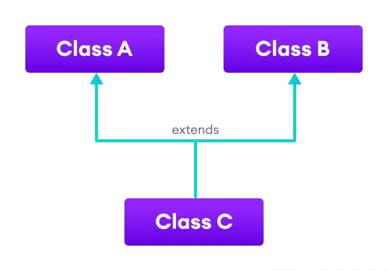

**MỌI THỨ ĐỀU LÀ ĐỐI TƯỢNG**
- [I. Tính đóng gói trong Java (encapsulation):](#i-tính-đóng-gói-trong-java-encapsulation)
  - [1. Tính đóng gói trong Java là gì?](#1-tính-đóng-gói-trong-java-là-gì)
  - [2. Tại sao phải sử dụng tính đóng gói?](#2-tại-sao-phải-sử-dụng-tính-đóng-gói)
  - [3. Cơ chế che giấu dữ liệu (data hiding) của lớp trong Java:](#3-cơ-chế-che-giấu-dữ-liệu-data-hiding-của-lớp-trong-java)
- [II. Tính kế thừa trong Java:](#ii-tính-kế-thừa-trong-java)
  - [1. Tính kế thừa trong Java là gì?](#1-tính-kế-thừa-trong-java-là-gì)
  - [2. Khai báo kế thừa (inheritance) trong Java](#2-khai-báo-kế-thừa-inheritance-trong-java)
  - [3. Các loại kế thừa trong Java:](#3-các-loại-kế-thừa-trong-java)
  - [4. Khai báo và hủy đối tượng (object) trong kế thừa:](#4-khai-báo-và-hủy-đối-tượng-object-trong-kế-thừa)
- [III. Tính đa hình trong Java:](#iii-tính-đa-hình-trong-java)
  - [1. Tính đa hình (polymorphism) trong Java là gì?](#1-tính-đa-hình-polymorphism-trong-java-là-gì)
  - [2. Tại sao sử dụng tính đa hình (polymorphism):](#2-tại-sao-sử-dụng-tính-đa-hình-polymorphism)
  - [3. Chuyển đổi kiểu dữ liệu đối tượng:](#3-chuyển-đổi-kiểu-dữ-liệu-đối-tượng)
  - [4. Toán tử `instanceof`:](#4-toán-tử-instanceof)

# I. Tính đóng gói trong Java (encapsulation):
## 1. Tính đóng gói trong Java là gì?
- Tính đóng gói (encapsulation) là việc đóng gói các thuộc tính và phương thức bên trong lớp. Tức là thiết kế để các thuộc tính và phương thức thuộc về (bên trong) một lớp.

- Với các access modifier, tính đóng gói sẽ có thể giúp ngăn chặn những lớp bên ngoài truy cập, thay đổi thuộc tính và phương thức của một lớp. Từ đó, giúp cho việc che giấu dữ liệu (data hiding).
```java
class HinhChuNhat{
    double chieudai;
    double chieurong;
    HinhChuNhat(double chieudai, double chieurong){
        this.chieudai = chieudai;
        this.chieurong = chieurong;
    }
    void tinhDientich(){
        double dientich = chieudai*chieurong;
        System.out.println("Dien tich hinh chu nhat = " + dientich);
    }
}
public class Main {
    public static void main(String args[]) {
        HinhChuNhat hcn = new HinhChuNhat(7, 5);
        hcn.tinhDientich();
    }
}
```
Lớp `HinhChuNhat` được tạo ra, mục đích chính của lớp này là tính diện tích. Để tính diện tích thì cần chiều dài và chiều rộng. Một hàm `tinhDientich()` được dùng để tính diện tích và xuất ra giá trị diện tích tính được. Chúng ta có thể gộp các thuộc tính và phương thức vào trong một lớp `HinhChuNhat`. Đó là sự đóng gói (encapsulation).
## 2. Tại sao phải sử dụng tính đóng gói?
Trong Java, tính đóng gói (encapsulation) giúp chúng ta đóng gói các thuộc tính và phương thức liên quan với nhau trong một lớp. Nó cũng giúp chúng ta có thể thay đổi giá trị của các thuộc tính thông qua phương thức. Điều này làm cho code rõ ràng và dễ đọc hơn
```java
    class HinhChuNhat{
        double chieudai;
        double chieurong;
        HinhChuNhat(double chieudai, double chieurong){
            this.chieudai = chieudai;
            this.chieurong = chieurong;
        }
        void tinhDientich(){
            double dientich = chieudai*chieurong;
            System.out.println("Dien tich hinh chu nhat = " + dientich);
        }
    }
    public class Main {
        public static void main(String args[]) {
            HinhChuNhat hcn1 = new HinhChuNhat(7, 5);
            hcn1.tinhDientich();
            HinhChuNhat hcn2 = new HinhChuNhat(9, 2);
            hcn2.tinhDientich();
            HinhChuNhat hcn3 = new HinhChuNhat(8, 7);
            hcn3.tinhDientich();
        }
    }
```
- Với cách sử dụng tính đóng gói thì dễ đọc, dễ hiểu hơn. Và quan trọng là khi muốn tính diện tích của nhiều hình chữ nhật thì rõ ràng, dễ hiểu hơn thay vì phải khai báo nhiều biến chiều dài và chiều rộng.

- Hơn nữa, nếu muốn thực hiện các thao tác khác trên hình chữ nhật như tính chu vi, thay đổi chiều dài, chiều rộng,… chỉ cần thêm phương thức xử lý vào lớp.

## 3. Cơ chế che giấu dữ liệu (data hiding) của lớp trong Java:
- **Data hiding** là một cách hạn chế quyền truy cập các thuộc tính dữ liệu của lớp bằng cách hạn chế phạm vi truy cập của chúng với các **access modifier**.

- Với chỉ định truy cập là **private** thì các thuộc tính dữ liệu chỉ có thể truy cập từ các phương thức bên trong lớp nhằm bảo vệ dữ liệu. Các đối tượng khác muốn truy nhập vào dữ liệu riêng tư này phải thông qua các phương thức public.

- Đó là các phương thức **accessor (getter)** trả về giá trị hiện tại của một thuộc tính và **mutator (setter)** sẽ thay đổi giá trị của một thuộc tính.

```java
    class Person {
        private int age; //thuộc tính private
        public int getAge() { //phương thức getter
            return age;
        }
        public void setAge(int age) { //phương thức setter
            this.age = age;
        }
    }

    class Main {
        public static void main(String[] args) {
            Person p1 = new Person();
            p1.setAge(24); //thay đổi thuộc tính age với setter
            System.out.println(p1.getAge()); //lấy giá trị thuộc tính age với getter
        }
    }
```

# II. Tính kế thừa trong Java:
## 1. Tính kế thừa trong Java là gì?
Bản chất kế thừa (inheritance) là phát triển lớp mới dựa trên các lớp đã có. Xây dựng các lớp mới có sẵn các đặc tính của lớp cũ, đồng thời lớp mới có thể mở rộng các đặc tính của nó.


- Ví dụ: 
  - Lớp Người có các thuộc tính như tên, tuổi, chiều cao, cân nặng,…; các phương thức như ăn, ngủ, chơi,…

  - Lớp Sinh Viên thừa kế từ lớp Người, thừa kế được các thuộc tính tên, tuổi, chiều cao, cân nặng,…; các phương thức ăn, ngủ, chơi,…Bổ sung thêm các thuộc tính như mã số sinh viên,… các phương thức như tham dự lớp học, thi…

- **Lớp kế thừa** gọi là lớp con (child, subclass), lớp dẫn xuất (derived class). 

- **Lớp được kế thừa** gọi là lớp cha (parent, superclass), lớp cơ sở (base class).
- **Mối quan hệ kế thừa**: Lớp con là một loại (is-a-kind-of) của lớp cha, kế thừa các thành phần dữ liệu và các hành vi của lớp cha. Có thể khai báo thêm thuộc tính, phương thức cho phù hợp với mục đích sử dụng mới.
- **Bản chất kế thừa** là một kỹ thuật tái sử dụng mã nguồn thông qua lớp.
## 2. Khai báo kế thừa (inheritance) trong Java
- Cú pháp:
    ```java
    <Lớp con> extends <Lớp cha>{
        //statements
    }
    ```
- Ví dụ:
    ```java
    public class Nguoi {
        String name;
        int age;
        void xinchao(){
            System.out.println("Hello");
            }
    }
    public class SinhVien extends Nguoi {
        String msv;
        void diHoc(){
            System.out.println("Di hoc");
            }
    }
    public class Main {
        public static void main(String[] args) {
            SinhVien sv1 = new SinhVien();
            sv1.name = "Trang";
            sv1.age = 19;
            sv1.msv = "001";
            sv1.xinchao();
            sv1.diHoc();
        }
    }
    ```
Trong ví dụ trên lớp `SinhVien` kế thừa từ lớp `Nguoi`. Lớp `SinhVien` kế thừa các thuộc tính `name`, `age` và phương thức `xinchao()` của lớp `Nguoi`
- Lớp con kế thừa các thành viên được khai báo là public, protected và mặc định (default) của lớp cha. **Không kế thừa được các thành viên private**.

## 3. Các loại kế thừa trong Java:
- **Đơn kế thừa (single inheritance)**: Một lớp con kế thừa từ 1 lớp cha


- **Kế thừa nhiều cấp (multilevel inheritance)**: Một lớp con kế thừa từ một lớp cha. Lớp cha đó lại kế thừa từ một lớp khác.


- **Kế thừa phân cấp (hierarchical inheritance)**: Nhiều lớp con kế thừa từ một lớp cha. Các lớp con có cùng lớp cha gọi là các lớp anh chị em (siblings).


- **Java không hỗ trợ đa kế thừa (multiple Inheritance)**: Trong Java không hỗ trợ đa kế thừa, tức là một lớp con kế từ từ nhiều lớp cha.

Nhưng trong Java có thể thực hiện đa kế thừa bằng cách sử dụng **interface**, chứ không đa kế thừa từ lớp (class) được để tránh những mơ hồ không cần thiết khi kế thừa.

- **Lưu ý**: Nếu một lớp không được định nghĩa là lớp con của một lớp khác thì mặc định nó là lớp con trực tiếp của **lớp Object**. Lớp này được định nghĩa trong `package` chuẩn `java.lang`, chứa một số phương thức hữu ích kế thừa lại cho tất cả các lớp.\

## 4. Khai báo và hủy đối tượng (object) trong kế thừa:
- Khởi tạo đối tượng: Lớp cha được khởi tạo trước lớp con. Các phương thức khởi tạo của lớp con luôn gọi phương thức khởi tạo của lớp cha ở câu lệnh đầu tiên.
  - Tự động gọi (ngầm định – implicit): khi lớp cha có phương thức khởi tạo mặc định.
  - Gọi trực tiếp (tường minh – explicit): sử dụng từ khóa **super**.

# III. Tính đa hình trong Java:
## 1. Tính đa hình (polymorphism) trong Java là gì?
- **Tính đa hình (polymorphism)**: hiểu đơn giản là các đối tượng, các phương thức giống nhau có thể có các hành vi khác nhau tùy vào từng tình huống khác nhau.
```java
public class TuGiac {
    public void draw(){
        System.out.println("Ve tu giac");
    }
}

public class HinhThoi extends TuGiac{
    @Override
    public void draw() {
        System.out.println("Ve hinh thoi");
    }
}

public class HinhChuNhat extends TuGiac{
    @Override
    public void draw() {
        System.out.println("Ve hinh chu nhat");
    }
}

public class Main {
    public static void main(String[] args) {
        TuGiac tgiac = new TuGiac();
        HinhThoi hthoi = new HinhThoi();
        HinhChuNhat hcn = new HinhChuNhat();
        tgiac.draw();
        hthoi.draw();
        hcn.draw();
    }
}
```

Kết quả: 

    Ve tu giac
    Ve hinh thoi
    Ve hinh chu nhat

Ở ví dụ trên: Lớp `TuGiac` có 2 lớp con là `HinhThoi` và `HinhChuNhat`. Chúng đều có hàm `draw()` nhưng hàm này thực thi khác nhau trong từng lớp. Đó là biểu hiện của **tính đa hình**.

## 2. Tại sao sử dụng tính đa hình (polymorphism):
- **Tính đa hình (polymorphism)** trong Java cho phép chúng ta tạo ra những mã code nhất quán. Lấy ví dụ ở phần 1, chúng ta có thể tạo ra các hàm `draw` cho từng lớp.

- Chương trình cũng sẽ hoạt động tốt nhưng việc tạo ra các tên khác nhau cho một hàm có chức năng giống nhau thì sẽ làm code không nhất quán, rườm rà, cồng kềnh.

- Tính đa hình cho phép chúng ta tạo ra một hàm tên là `draw()` duy nhất nhưng sẽ thực thi khác nhau với từng lớp khác nhau.

- Trong Java, chúng ta có thể đạt được tính đa hình (polymorphism) với **nạp chồng phương thức (method overloading)**, **ghi đè phương thức (method overriding)**.

Lưu ý: Trong Java không hỗ trợ  tự định nghĩa **nạp chồng toán tử (operator overloading)** như trong C++.

## 3. Chuyển đổi kiểu dữ liệu đối tượng: 
Kiểu dữ liệu tham chiếu (các lớp) có thể được chuyển đổi kiểu khi kiểu dữ liệu tham chiếu (lớp) tương thích, tức là nằm trên cùng một cây phân cấp kế thừa.


Có 2 cách chuyển đổi là: **Up-casting** và **Down-casting**
- **Up-casting**:
  - Gán object của lớp con cho biến tham chiếu của lớp cha
  - Tự động chuyển đổi kiểu.
- **Down-casting**:
  - Gán object của lớp cha cho biến tham chiếu của lớp con.
  - Không tự động chuyển đổi kiểu, phải ép kiểu.

## 4. Toán tử `instanceof`:
- Toán tử `instanceof` trong Java được sử dụng để kiểm tra một đối tượng có phải là thể hiện của một kiểu dữ liệu (lớp) nào đó hay không.
- `instanceof` trong Java được gọi là toán tử so sánh kiểu.
  -  Nó trả về giá trị `boolean` là **true** hoặc **false**.
  -  Nếu bạn dùng toán tử `instanceof` với bất kỳ biến nào mà có giá trị `null` thì kết quả trả về sẽ là **false**
  
Ví dụ:

```java
public class Simple {
	public static void main(String args[]) {
		Simple s = new Simple();
		System.out.println(s instanceof Simple); // true
    }
}
```
Một đối tượng có kiểu của lớp con thì cũng có kiểu của lớp cha.

Ví dụ: Nếu `Dog` kế thừa từ `Animal` thì đối tượng của `Dog` có thể tham chiếu đến cả hai lớp `Dog` và `Animal`.
```java
class Animal {}
public class Dog extends Animal {
	public static void main(String args[]) {
		Dog dog = new Dog();
		System.out.println(dog instanceof Animal); // true
	}
}
```

