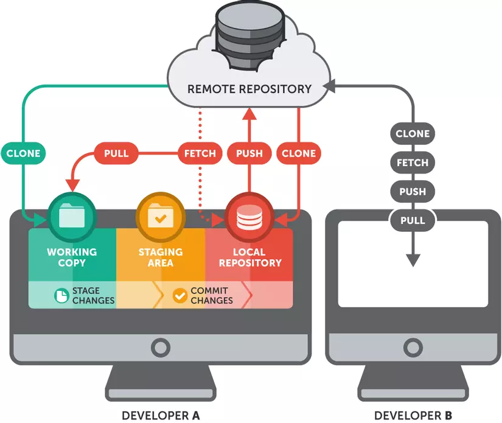
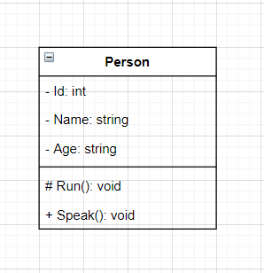

**DEV KHÔNG CHỈ VIẾT CODE**

- [I. Version Control là gì?](#i-version-control-là-gì)
  - [1. Version Control là gì?](#1-version-control-là-gì)
  - [2. Tại sao cần sử dụng?](#2-tại-sao-cần-sử-dụng)
- [II. Các khái niệm về GIT:](#ii-các-khái-niệm-về-git)
  - [1. Repository:](#1-repository)
  - [2. Branch:](#2-branch)
  - [3. Commit:](#3-commit)
  - [4. Merge:](#4-merge)
  - [5. Pull:](#5-pull)
  - [6. Push:](#6-push)
  - [7. Clone:](#7-clone)
  - [8. Fork:](#8-fork)
- [III. Pull Request:](#iii-pull-request)
- [IV. UML:](#iv-uml)
- [V. Class Diagram \& Activity Diagram:](#v-class-diagram--activity-diagram)
  - [1. Class Diagram (Biểu đồ lớp):](#1-class-diagram-biểu-đồ-lớp)
  - [2. Activity Diagram (Bản vẽ hoạt động):](#2-activity-diagram-bản-vẽ-hoạt-động)


# I. Version Control là gì?

## 1. Version Control là gì?
**Version Control System (VCS) - Hệ thống quản lí phiên bản**: là một hệ thống ghi nhận và lưu lại sự thay đổi của các file theo thời gian, từ hệ thống đó một file có thể phục hồi quay về trạng thái (phiên bản) ở một thời điểm trước đó. Ngoài ra bạn có thể theo dõi sự thay đổi của một file theo thời gian, ai đã thay đổi, thay đổi vào lúc nào .... 

Có nhiều hệ thống VCS mà bạn có thể chọn sử dụng như: Concurrent Versions System, Subversion, Git, Mercurial.

## 2. Tại sao cần sử dụng?
Version Control mang lại nhiều lợi ích cho các lập trình viên, đặc biệt là khi làm việc nhóm.

- Lưu trữ lịch sử của các thay đổi, từ đó có thể khôi phục lại các phiên bản trước đó, so sánh các phiên bản, xem ai đã thực hiện thay đổi gì và khi nào.

- Hỗ trợ cộng tác giữa các lập trình viên, từ đó có thể chia sẻ mã nguồn, đồng bộ hóa các thay đổi, giải quyết các xung đột, phân quyền và quản lý quy trình phát triển.

- Tăng hiệu quả và chất lượng của sản phẩm, từ đó có thể kiểm tra và sửa lỗi dễ dàng, phát hiện và ngăn chặn các vấn đề tiềm ẩn, đảm bảo tính nhất quán và bảo mật của mã nguồn.

# II. Các khái niệm về GIT:

- **Git** là một hệ thống quản lý phiên bản phân tán (Distributed Version Control System – DVCS)

- Nó là một trong những hệ thống quản lý phiên bản phân tán phổ biến nhất hiện nay.

- Git cung cấp cho mỗi lập trình viên kho lưu trữ (repository) riêng chứa toàn bộ lịch sử thay đổi.



## 1. Repository:
Là nơi lưu trữ tất cả những thông tin cần thiết để duy trì và quản lý các sửa đổi và lịch sử của dự án

Khi sử dụng git, lệnh đầu tiên mà chúng ta thường gõ: `$ git init`. Lệnh này sẽ tạo ra một thư mục ẩn có tên `.git` và đây chính là repository (hay kho chứa). Còn phần code hay hay thư mục của project nằm cùng với thư mục `.git` được gọi là **Working Directory**

Có 2 loại repository:

- **Local Repository**: là repository nằm trên máy tính của bạn, dành cho 1 người sử dụng repository này sẽ đồng bộ hóa với remote repository bằng các lệnh của git.

- **Remote Repository**:  là repository được cài đặt trên server chuyên dụng. Ví dụ: GitHub, GitLab, Bitbucket,...

## 2. Branch: 
Các **Branch** (nhánh) đại diện cho các phiên bản cụ thể của một kho lưu trữ tách ra từ project chính của bạn

- `master` là nhánh mặc định của repository

- Branch mới được tạo ra sẽ chứa toàn bộ trạng thái và những thay đổi đã thực hiện trên project trước khi được tạo. 

- Với mỗi repository ta có thể tạo nhiều branch khác nhau và các nhánh này là độc lập với nhau nên khi ta có thay đổi đối với project trên branch này sẽ không ảnh hưởng đến các branch khác

## 3. Commit:

Commit là thao tác có chức năng ghi lại những thay đổi file hay thư mục vào kho lưu trữ, những thay đổi này sẽ được lưu vào thư mục commit trong kho và được sắp xếp theo thứ tự thời gian chỉnh. Do đó khi nhìn vào thư mục commit bạn sẽ biết lịch sử chỉnh sửa/thay đổi các file hoặc thư mục.

## 4. Merge:

Được dùng khi ta muốn **gộp 2 branch** lại với nhau, thao tác này thường dùng để merge branch khác vào branch chính trước khi push lên remote repository, hoặc merge hai branch thành một để giải quyết chung một task.

```
$ git merge <branch_name>

$ git merge <branch-name> <merged-branch-name>
```

## 5. Pull:

`Pull` để tải xuống dữ liệu từ một Remote repository và cập nhật Local repository phù hợp với dữ liệu đó. Nói cách khác, Git Pull là lệnh hợp nhất các thay đổi từ Remote repository vào Local repository.

```
$ git pull origin master
```

## 6. Push:

`Push` dùng để đẩy những thay đổi từ Local repository lên Remote repository

```
$ git push origin <name_branch>
```

## 7. Clone:

`Clone` cho phép tạo ra bản sao dữ liệu hoàn chỉnh của kho đang được lưu chứa trên máy chủ và tất cả lịch sử trên kho. Với Clone, bạn có thể phục hồi bất kỳ bước nào dù đã commit. Đặc biệt, dù ổ cứng máy chủ có bị hư hỏng và không sử dụng được, bạn vẫn có thể sử dụng Clone của máy khách bất kỳ để khôi phục lại dữ liệu máy chủ.

```
$ git clone path-git
```

## 8. Fork:

- Là hành động tạo một dự án mới dựa trên dự án đã có sẵn. Cho phép bạn sao chép hoàn toàn một repository cũ, sau đó thay đổi hoặc chỉnh sửa một vài thứ cần thiết và lưu phiên bản mới này dưới dạng một repository độc lập hoàn toàn mới và gọi nó là dự án của riêng bạn.

- Đây là tính năng giúp đẩy nhanh tiến độ của dự án. Vì là một dự án mới nên repository cũ không ảnh hưởng. Khi repository tổng được cập nhật, bạn cũng có thể áp dụng các cập nhật đó lên bản fork của bạn.

# III. Pull Request:

- Khi một người dùng muốn đóng góp vào một dự án, họ có thể tạo một branch (nhánh) riêng từ branch chính (thường là branch master), thực hiện các thay đổi cần thiết trong branch này, rồi đưa các thay đổi lên remote repository và tạo một **pull request**.

- **Pull Request** bao gồm các thông tin về các thay đổi đã thực hiện, các commit mới, các nhận xét, v.v. Người sở hữu dự án hoặc các thành viên khác của dự án có thể xem và kiểm tra các thay đổi trước khi chấp nhận hoặc từ chối pull request.

- Khi một pull request được chấp nhận, các thay đổi được hợp nhất vào branch chính của dự án. Quá trình này có thể được tự động hóa bằng các công cụ tích hợp liên kết với hệ thống quản lý mã nguồn. Pull request là một cách linh hoạt và an toàn để đóng góp vào dự án và đảm bảo rằng các thay đổi mới không gây ra tác động tiêu cực đến mã nguồn hiện có.

**Các bước tạo 1 Pull Request**

1. **Tạo một branch mới**: Trước khi bắt đầu chỉnh sửa mã nguồn, bạn nên tạo một branch mới để làm việc trên đó. Điều này đảm bảo rằng các thay đổi của bạn không ảnh hưởng đến mã nguồn chính của dự án.
2. **Chỉnh sửa mã nguồn**: Tiếp theo, bạn sẽ chỉnh sửa mã nguồn trên branch mới của mình. Bạn có thể thêm, sửa đổi hoặc xóa bất kỳ file nào tùy ý, tùy theo mục đích của bạn.
3. **Commit thay đổi**: Sau khi bạn hoàn thành chỉnh sửa mã nguồn, bạn sẽ phải commit các thay đổi của mình vào branch mới của mình. Mỗi commit sẽ đại diện cho một bản sao của mã nguồn với các thay đổi mới của bạn.
4. **Tạo Pull Request**: Khi các thay đổi của bạn đã được commit vào branch mới, bạn có thể tạo Pull Request để gộp các thay đổi của mình vào nhánh chính của dự án. Trong quá trình tạo Pull Request, bạn sẽ cung cấp thông tin về các thay đổi của mình và mô tả về mục đích của các thay đổi đó.
5. **Xem xét và thảo luận**: Các nhà phát triển khác có thể xem và xem xét các thay đổi của bạn trong Pull Request. Họ có thể đưa ra các ý kiến, đề xuất sửa đổi hoặc chỉnh sửa thêm để tăng tính ổn định và hiệu quả của mã nguồn.
6. **Merge Pull Request**: Cuối cùng, sau khi các thay đổi đã được xem xét và chấp nhận, bạn có thể merge Pull Request vào nhánh chính của dự án. Khi Pull Request được merge, các thay đổi của bạn sẽ được áp dụng vào nhánh chính và được phát hành trong phiên bản tiếp theo của dự án.

# IV. UML:

- **Ngôn ngữ mô hình hóa thống nhất** (tiếng Anh: Unified Modeling Language, viết tắt thành UML) là một ngôn ngữ mô hình gồm các ký hiệu đồ họa mà các phương pháp hướng đối tượng sử dụng để thiết kế các hệ thống thông tin một cách nhanh chóng.

Lí do cần sử dụng UML:

- Có cái nhìn bao quát hệ thống và nắm bắt trọn vẹn yêu cầu của khách hàng.
- UML hỗ trợ việc thiết kế hệ thống bằng cách mô tả các lớp, đối tượng, mối quan hệ, và các phần tử khác của hệ thống. Cho phép nhóm phát triển hiểu cấu trúc và quan hệ giữa các thành phần của hệ thống.
- UML cung cấp một ngôn ngữ chung để giao tiếp giữa các thành viên trong nhóm phát triển, giúp họ hiểu rõ ý tưởng và thiết kế của nhau.

# V. Class Diagram & Activity Diagram:
## 1. Class Diagram (Biểu đồ lớp): 
Một biểu đồ lớp chỉ ra cấu trúc tĩnh của các lớp trong hệ thống. Các lớp là đại diện cho các “đối tượng” được xử lý trong hệ thống. Các lớp có thể quan hệ với nhau trong nhiều dạng thức:
- **Liên kết** (associated - được nối kết với nhau)
- **Phụ thuộc** (dependent - một lớp này phụ thuộc vào lớp khác)
- **Chuyên biệt hóa** (specialized - một lớp này là một kết quả chuyên biệt hóa của lớp khác)
- **Đóng gói** ( packaged - hợp với nhau thành một đơn vị)

**Một lớp có các thành phần sau**:
- Tên lớp
- Các thuộc tính
- Các phương thức

**Access Modifier trong Class Diagram**:
- Private ( – )
- Public ( + )
- Protected ( # )
- Package/ Default



**Class Relationship**:

- Một lớp có thể tham gia vào một hoặc nhiều mối quan hệ với một lớp khác


- **Inheritance**: 1 class kế thừa từ 1 class khác.

- **Association**: 2 class có liên hệ với nhau nhưng không chỉ rõ mối liên hệ.

- **Composition**: Đối tượng tạo từ class A mất thì đối tượng tạo từ class B sẽ mất.

- **Agreegation**: Đối tượng tạo từ lass A mất thì đối tượng tạo từ class B vẫn tồn tại độc lập.

## 2. Activity Diagram (Bản vẽ hoạt động):

**Activity Diagram** là bản vẽ tập trung vào mô tả các hoạt động, luồng xử lý bên trong hệ thống. Nó có thể được sử dụng để mô tả các qui trình nghiệp vụ trong hệ thống, các luồng của một chức năng hoặc các hoạt động của một đối tượng.

Các thành phần của Activity Diagram:
- **Start**
  - Kí hiệu: 
  
    
  - Đặc điểm: 
    - Khởi tạo 1 hoạt động
    - Một activity diagram có thể nhiều trạng thái Start
    
- **Transition**
  - Kí hiệu: 

    
  - Đặc điểm: Mô tả sự chuyển đổi trạng thái của các hoạt động

- **Activity**
  - Kí hiệu: 

    
  - Đặc điểm: 
    - Mô tả hành vi của đối tượng trong quy trình
    - Tên hoạt động phải ngắn gọn, đủ nghĩa. Nên đặt là động từ và mô tả đầy đủ ý nghĩa tổng thể của hoạt động nhất có thể.

- **Decision**
  - Kí hiệu: 

    
  - Đặc điểm: 
    - Đây là kí hiệu biểu thị nút điều kiện chuyển hướng. Tùy theo trường hợp đúng hay sai của kết quả mà có hướng di chuyển tiếp theo tương ứng.
    - Decision bao gồm hai loại sau: Branch và Merge

- **Branch**
  - Kí hiệu: 

  
  - Đặc điểm:
    - Mô tả điều kiện rẽ nhánh
    - Chỉ một dòng điều khiển đi vào
    - Hai hoặc nhiều dòng điều khiển đi ra
    - Chỉ một dòng điều khiển dẫn đến kết quả
    - Mỗi dòng chứa một điều kiện (guard), guard phải liên quan đến điều kiện và loại trừ nhau
- **Merge**
  - Kí hiệu:

  
  - Đặc điểm:
    - Có hai hoặc nhiều dòng điều khiển đi vào
    - Chỉ một dòng điều khiển đi ra

- **End**
  - Kí hiệu: 

  
  - Đặc điểm: 
    - Mô tả trạng thái kết thúc quy trình
    - Một activity diagram có thể có một hoặc nhiều trạng thái kết thúc