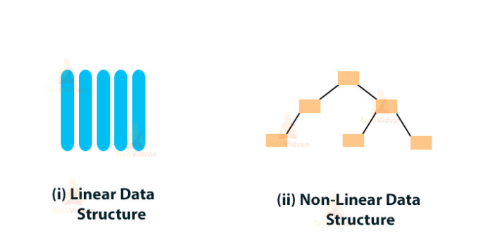
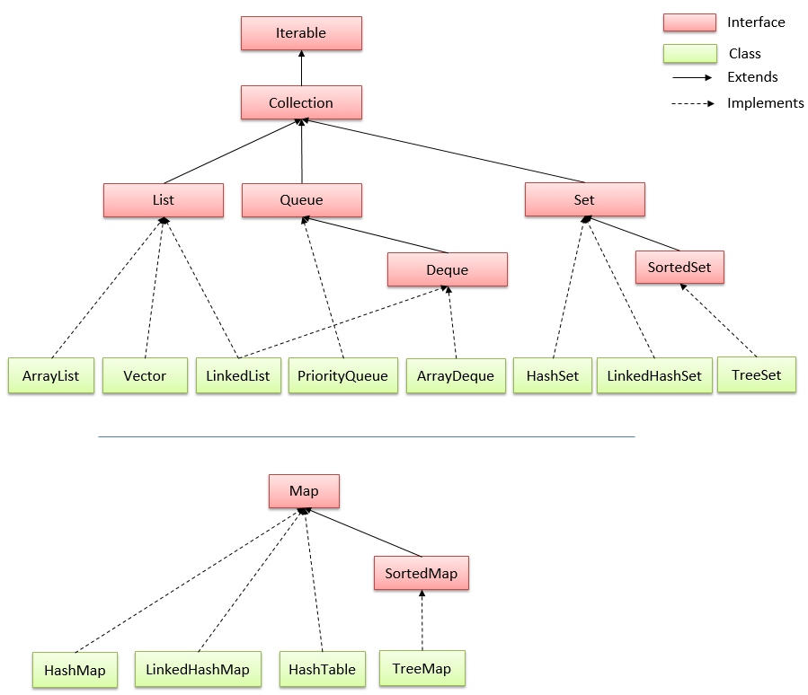
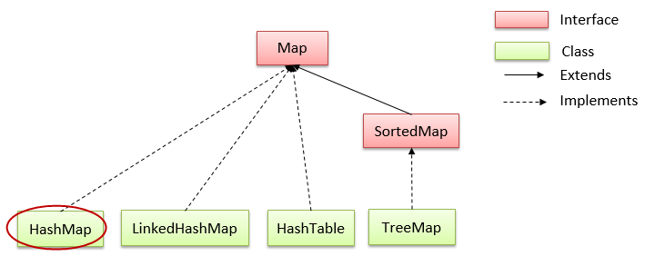

**MỘT SỐ CẤU TRÚC DỮ LIỆU THƯỜNG THẤY TRONG JAVA**
- [I. Cấu trúc dữ liệu là gì, sử dụng khi nào?](#i-cấu-trúc-dữ-liệu-là-gì-sử-dụng-khi-nào)
- [II. Interface Iterable và Collection:](#ii-interface-iterable-và-collection)
  - [1. Interface Iterable:](#1-interface-iterable)
  - [2. Collection:](#2-collection)
- [III. Một số interface chính của Collection:](#iii-một-số-interface-chính-của-collection)
  - [1. List:](#1-list)
  - [2. Set:](#2-set)
  - [3. Queue:](#3-queue)
- [IV. Interface Map:](#iv-interface-map)
  - [1. Hash Map:](#1-hash-map)
  - [2. SortedMap và TreeMap:](#2-sortedmap-và-treemap)
- [V. Sorting trong Collections:](#v-sorting-trong-collections)

# I. Cấu trúc dữ liệu là gì, sử dụng khi nào?
- Thuật ngữ cấu trúc dữ liệu đề cập đến một tập hợp dữ liệu với các hoạt động và hành vi hoặc thuộc tính được xác định rõ ràng. Cấu trúc dữ liệu là một cách duy nhất để lưu trữ hoặc tổ chức dữ liệu trong bộ nhớ máy tính để chúng ta có thể sử dụng nó một cách hiệu quả.
- Ưu điểm của việc sử dụng cấu trúc dữ liệu:
  - **Hiệu quả**: Cấu trúc dữ liệu được sử dụng để tăng hiệu quả và hiệu suất của ứng dụng bằng cách tổ chức dữ liệu theo cách mà nó cần ít dung lượng hơn với tốc độ xử lý cao hơn.
  - **Khả năng tái sử dụng**: Cấu trúc dữ liệu cung cấp khả năng tái sử dụng của dữ liệu, đó là sau khi thực hiện một cấu trúc dữ liệu cụ thể một lần, chúng ta có thể sử dụng nó nhiều lần ở bất kỳ nơi nào khác. Chúng ta có thể biên dịch việc triển khai các cấu trúc dữ liệu này thành các thư viện và khách hàng có thể sử dụng các thư viện này theo nhiều cách.
  - **Tính trừu tượng**: Chương trình chỉ sử dụng cấu trúc dữ liệu với sự trợ giúp của interface mà không cần biết về chi tiết triển khai.
- Phân loại:
  - **Cấu trúc dữ liệu tuyến tính**: Trong cấu trúc dữ liệu tuyến tính, tất cả các phần tử được sắp xếp theo thứ tự tuyến tính hoặc tuần tự. Cấu trúc dữ liệu tuyến tính là cấu trúc dữ liệu mức đơn.
  - **Cấu trúc dữ liệu phi tuyến tính**: Cấu trúc dữ liệu phi tuyến tính không sắp xếp dữ liệu theo cách tuần tự như trong cấu trúc dữ liệu tuyến tính. Cấu trúc dữ liệu phi tuyến tính là cấu trúc dữ liệu đa cấp.

    

# II. Interface Iterable và Collection:
## 1. Interface Iterable:
- Giao diện Iterable là một trong những giao diện cốt lõi trong Java, nằm trong gói `java.lang`. Nó được sử dụng để duyệt qua các phần tử trong 1 tập hợp dữ liệu (collection) như mảng, danh sách liên kết hoặc tập hợp (Set) một cách trừu tượng. 
- Giao diện này định nghĩa một phương thức duy nhất là `Iterator<T> iterator()`, nơi mà các lớp triển khai phải cung cấp một trình duyệt (iterator) để lặp qua các phần tử của tập hợp.
Ví dụ:
```java
public class Main {
    public static void main(String[] args) {
        List<String> danhSach = new ArrayList<>();
        danhSach.add("Java");
        danhSach.add("Python");
        danhSach.add("C++");

        // Sử dụng Iterable và Iterator để duyệt qua danh sách liên kết
        Iterable<String> iterable = danhSach;
        Iterator<String> iterator = iterable.iterator();
        while (iterator.hasNext()) {
            String phanTu = iterator.next();
            System.out.println(phanTu);
        }
    }
}
```
- Sử dụng giao diện Iterable giúp cho việc duyệt qua các phần tử trong tập hợp dễ dàng và trừu tượng hơn, giúp tăng tính linh hoạt và tái sử dụng trong việc xử lý dữ liệu trong Java.

## 2. Collection: 
- **Collection trong Java** là một root interface trong hệ thống cấp bậc Collection. Java Collection cung cấp nhiều interface (Set, List, Queue, Deque vv) và các lớp (ArrayList, Vector, LinkedList, PriorityQueue, HashSet, LinkedHashSet, TreeSet vv).



# III. Một số interface chính của Collection:
## 1. List:
- Là một collection có thứ tự. List có thể chứa các phần tử trùng lặp. Thường có quyền kiểm soát chính xác vị trí các phần tử được chèn vào và có thể truy cập chúng bằng chỉ số (vị trí của chúng).
-  Các phương thức của interface List trong Java bao gồm `add`, `addAll`, `get`, `set`, `remove`, `clear`, `contains`, `isEmpty`, `size`, `subList`, ... 
-  Các lớp cài đặt của List trong Java bao gồm
   -   ArrayList
   -   LinkedList
   -   Stack
   -   Vector.

Ví dụ:
```java
import java.util.*;

public class Main {
    public static void main(String[] args) {
        List<String> list = new ArrayList<String>();
        list.add("Cat");
        list.add("Dog");
        list.add(1, "Fish");
        list.add("Dog");
        System.out.println(list.size()); // 4
        System.out.println(list); // [Cat, Fish, Dog, Dog]
    }
}
```
## 2. Set:
- Là một collection không thể chứa 2 giá trị trùng lặp.
- Các lớp cài đặt của Set gồm: 
  - **HashSet** lưu trữ các phần tử của nó trong bảng băm, là cách thực hiện tốt nhất, tuy nhiên nó không đảm bảo về thứ tự các phần tử được chèn vào.
  - **TreeSet** lưu trữ các phần tử của nó trong một cây, sắp xếp các phần tử của nó dựa trên các giá trị của chúng, về cơ bản là chậm hơn HashSet.
  - **LinkedHashSet** được triển khai dưới dạng bảng băm với có cấu trúc dữ liệu danh sách liên kết, sắp xếp các phần tử của nó dựa trên thứ tự chúng được chèn vào tập hợp (thứ tự chèn).
  - **EnumSet** là một cài đặt chuyên biệt để sử dụng với các kiểu enum.
- Các phương thức: `add`, `addAll`, `remove`, `clear`, `contains`, `isEmpty`, `size`, ... 

Ví dụ:
```java
import java.util.*;

public class Main {
    public static void main(String[] args) {
        Set<String> set = new HashSet<>();
        set.add("Dog");
        set.add("Cat");
        set.add("Fish");
        set.add("Dog");
        System.out.println(set.size()); // 3
        System.out.println(set.contains("Fish")); // true
        System.out.println(set); // [Cat, Fish, Dog]
    }
}
```

## 3. Queue: 
- Trong hàng đợi (trong Queue), các phần tử được lưu trữ và truy cập theo cách nhập trước, xuất trước (FIFO - First In First Out)
- Các lớp cài đặt của Queue bao gồm: 
  - ArrayDeque
  - LinkedList
  - PriorityQueue
- Một số phương thức thường được sử dụng của Queue:
  - add(): Chèn phần tử đã chỉ định vào hàng đợi.
  - peek() - Trả về đầu của hàng đợi. Trả về null nếu hàng đợi trống.
  - poll() - Trả về và loại bỏ phần đầu của hàng đợi

# IV. Interface Map:
**Map**: được sử dụng để lưu trữ và truy xuất dữ liệu theo cặp **key** và **value**. Mỗi cặp key và value được gọi là **mục nhập (entry)**. Map trong java chỉ chứa các giá trị key duy nhất. Map rất hữu ích nếu bạn phải tìm kiếm, cập nhật hoặc xóa các phần tử trên dựa vào các key.



- Các lớp cài đặt của Map:
  - HashMap
  - LinkedHashMap
  - HashTable
  - TreeMap

- Một số phương thức: get(), put(), remove(), keySet(),...

Ví dụ:
```java
public class Main {
    public static void main(String[] args) {
        Map<Integer, String> map = new TreeMap<>();
        map.put(1, "A");
        map.put(5, "E");
        map.put(3, "C");
        System.out.println(map.keySet()); // [1, 3, 5]
    }
}
```
## 1. Hash Map:
Lớp HashMap trong Java là một lớp **triển khai của Map Interface** trong Collections Framework nên nó sẽ có một vài đặc điểm và phương thức tương đồng với Map.

- Một số đặc điểm:
  - HashMap lưu trữ dữ liệu dưới dạng cặp key và value.
  - Chứa các key duy nhất.
  - Có thể có 1 key là null và nhiều giá trị null.
  - Duy trì các phần tử KHÔNG theo thứ tự.

## 2. SortedMap và TreeMap:
- **SortedMap**: là một Map chứa các **phần tử được sắp xếp theo thứ tự tăng dần của key** của chúng. Các SortedMap được sử dụng cho các collection theo thứ tự tự nhiên của cặp key/value, chẳng hạn như từ điển và danh bạ điện thoại.
- **Lớp TreeMap**:là một lớp triển khai của SortedMap, SortedMap kế thừa Map interface. Nên nó sẽ có một vài đặc điểm và phương thức tương đồng với Map và SortedMap.

- Một số đặc điểm: 
  - TreeMap lưu trữ dữ liệu dưới dạng cặp key và value.
  - Chứa các key duy nhất.
  - KHÔNG cho phép bất kỳ key nào là null và nhưng có thể có nhiều giá trị null.
  - Duy trì các phần tử được thêm vào theo thứ tự key tăng dần.

# V. Sorting trong Collections:
Lớp Collections trong java cung cấp các phương thức static để sắp xếp các phần tử của collection. Nếu các phần tử collection thuộc kiểu Set hoặc Map, chúng ta có thể sử dụng TreeSet hoặc TreeMap. Collections cung cấp phương thức sort() để phân sắp xếp các phần tử.

- Phương thức Collections.sort(List): được sử dụng để sắp xếp các phần tử của List. Với điều kiện các phần tử của List phải là kiểu Comparable. Nghĩa là lớp các phần tử phải được implements giao diện Comparable
  - Lớp String và các lớp Wrapper được implements giao diện Comparable => Có thể áp dụng phương thức Collections.sort(List list) mà không phải cài đặt gì thêm.
  - Còn đối với List của các đối tượng do người dùng tự định nghĩa thì phải implements giao diện Comparable cho lớp của đối tượng đó.

Ví dụ: 
```java
public class Main {
    public static void main(String[] args) {
        List<Integer> list = new ArrayList<>();
        list.add(10);
        list.add(5);
        list.add(9);
        list.add(20);
        System.out.println(list); // [10, 5, 9, 20]
        Collections.sort(list);
        System.out.println(list); // [5, 9, 10, 20]
    }
}
```
- Đối với String và các lớp Wrapper, mặc định là sắp xếp tăng dần
- Sắp xếp giảm dần: Sử dụng phương thức `Collections.sort(list, new Comparator<T>())`

Ví dụ:
```java
public class Main {
    public static void main(String[] args) {
        List<Integer> list = new ArrayList<>();
        list.add(10);
        list.add(5);
        list.add(9);
        list.add(20);
        System.out.println(list); // [10, 5, 9, 20]
        Collections.sort(list, new Comparator<Integer>() {
            @Override
            public int compare(Integer o1, Integer o2) {
                return o1 > o2 ? -1 : 0;
//                return o2.compareTo(o1);
            }
        });
        System.out.println(list); // [5, 9, 10, 20]
    }
}
```
- Đối với các đối tượng người dùng tự định nghĩa:
  - Cách 1:  phải implements giao diện java.lang.Comparable để cài đặt phương thức compareTo()
    ```java
    public class SinhVien implements Comparable<SinhVien> {
        private String name, msv;
        private double gpa;

        public SinhVien(String name, String msv, double gpa) {
            this.name = name;
            this.msv = msv;
            this.gpa = gpa;
        }

        @Override
        public int compareTo(SinhVien o) {
            return this.getName().compareTo(o.getName());
        }
        //getter & setter
    }
    public class Main {
        public static void main(String[] args) {
            List<SinhVien> list = new ArrayList<>();
            list.add(new SinhVien("AB", "001", 3.2));
            list.add(new SinhVien("AAA", "003", 3.0));
            list.add(new SinhVien("BCB", "002", 2.0));
            Collections.sort(list);
            for(SinhVien sinhVien : list){
                System.out.println(sinhVien.getName()); // AAA AB BCB
            }
        }
    }
    ```
  - Cách 2: Tạo đối tượng Comparator để cài đặt phương thức compare().Phải cài đặt tiêu chí để so sánh trong phương thức compare() để so sánh các đối tượng với nhau:
    ```java
    public class SinhVien{
        private String name, msv;
        private double gpa;

        public SinhVien(String name, String msv, double gpa) {
            this.name = name;
            this.msv = msv;
            this.gpa = gpa;
        }
    }
    public class Main {
        public static void main(String[] args) {
            List<SinhVien> list = new ArrayList<>();
            list.add(new SinhVien("AB", "001", 3.2));
            list.add(new SinhVien("AAA", "003", 3.0));
            list.add(new SinhVien("BCB", "002", 2.0));
            Collections.sort(list, new Comparator<SinhVien>() {
                @Override
                public int compare(SinhVien o1, SinhVien o2) {
                    return o1.getMsv().compareTo(o2.getMsv());
                }
            });
            for(SinhVien sinhVien : list){
                System.out.println(sinhVien.getMsv()); // 001 002 003
            }
        }
    }
    ```